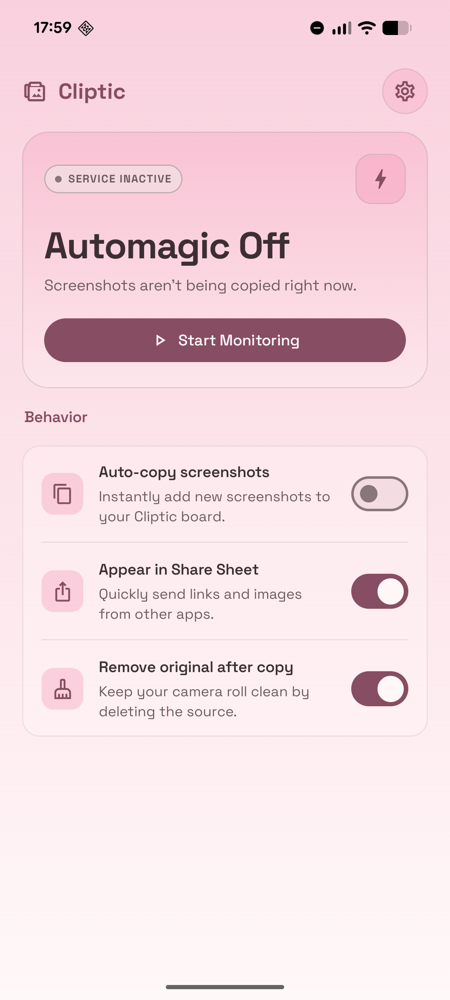
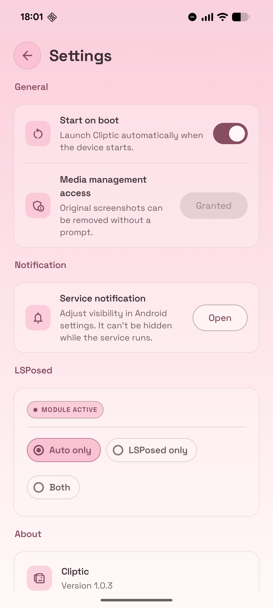
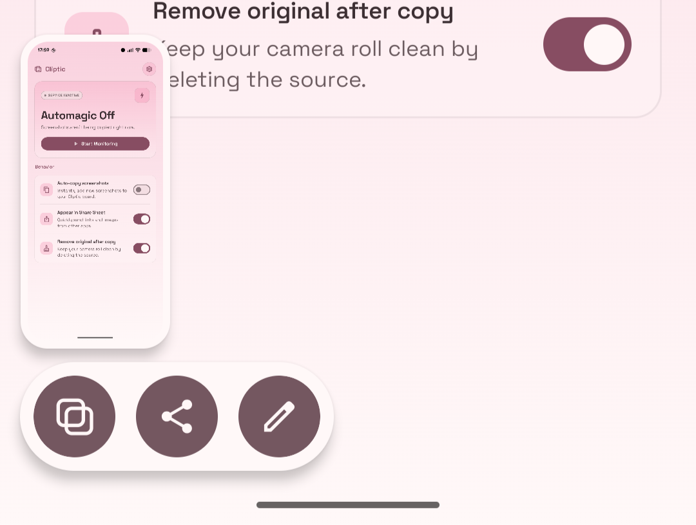
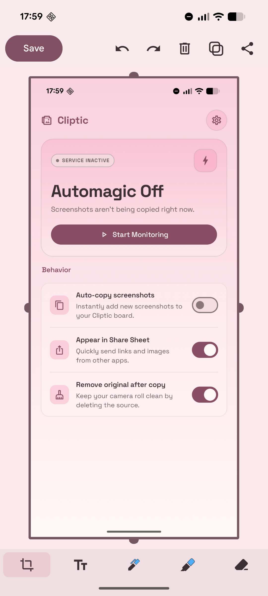

# Cliptic

Cliptic (`clip + automatic`) is an Android app that copies screenshots to the clipboard the moment they are taken — paste them anywhere without opening the gallery first.

**[Download latest release →](https://github.com/yniyniyni/Cliptic/releases/latest)**

<p align="center">
  
  &nbsp;&nbsp;&nbsp;&nbsp;
  
</p>

## Features

**Standalone (no root required)**
- Watches MediaStore for new screenshots and copies them to the clipboard automatically
- Quick Settings tile for one-tap pause/resume
- Share Sheet integration: receive an image from any app and copy it to the clipboard instantly
- Optional cleanup of the original gallery screenshot after copying, using `MediaStore.createTrashRequest`
- Starts automatically on boot
- Foreground service with a persistent notification (visibility adjustable via Android notification settings)

**LSPosed / Vector module (root + LSPosed or Vector required)**
- Injects a "Copy" chip directly into the Android 16 Pixel screenshot shelf toolbar — the same row as Share and Edit
- Injects a "Copy" button into the Pixel Markup (screenshot edit) screen
- Works via a signed IPC bridge between the SystemUI process and the Cliptic app; the app handles the clipboard write

Both modes can run simultaneously (`both`) or independently (`auto` or `xposed`).

## Requirements

- **Android 14+** (`minSdk = 34`)
- **JDK 17**, Android SDK 36
- For the LSPosed module: a rooted phone with AOSP/LOS/Stock like ROM based on Android 16 with LSPosed or Vector exposing libxposed API 100 (tested on Pixel 8, stock Android 16, Vector 2.0)

## Build

```sh
./gradlew assembleDebug          # all debug APKs
./gradlew :app:assembleDebug     # standalone app only
./gradlew :xposed:assembleDebug  # LSPosed module only
./gradlew test                   # local unit tests
```

## Install

**Standalone app**

```sh
./gradlew :app:installDebug
```

On first launch, grant photo and notification permissions when prompted. Auto-copy can be toggled from the app UI or the Quick Settings tile.

**LSPosed module**

1. Build `:xposed:assembleDebug` and install the APK on the rooted device.
2. Enable the module in LSPosed or Vector.
3. Scope it to `com.android.systemui` and `art.yniyniyni.cliptic`.
4. Reboot or restart SystemUI.

## How It Works

### Standalone copy flow

`ScreenshotService` runs as a foreground service and owns a `ScreenshotDetector`. The detector observes `MediaStore.Images.Media.EXTERNAL_CONTENT_URI`, filters for recent images whose `RELATIVE_PATH` contains `Screenshots`, waits ~500 ms for the file to finish writing, then passes the URI to the service. The service copies the image into `cacheDir/cliptic_clipboard`, exposes it through `FileProvider`, and writes that URI to the clipboard via `ClipboardWriter`. Cached files expire after one hour by default.

### Share Sheet flow

When Cliptic receives an `image/*` share intent, `ShareReceiverActivity` runs the same cache-and-copy pipeline, shows a short confirmation toast, and finishes without showing any UI.

### LSPosed copy flow

`CopyButtonInjector` hooks `ScreenshotShelfViewBinder.access$updateActions` in the `com.android.systemui` process, prepending a `Copy` `ActionButtonViewModel` to the action list so the framework renders, styles, and recycles the chip exactly like Share and Edit. On tap the module reads the IPC secret from `XposedSecretProvider` and broadcasts `ACTION_COPY_SCREENSHOT` (with the screenshot URI and the secret) to the Cliptic app. The app validates the secret, caches the image, and writes it to the clipboard. It then sends `ACTION_COPY_SCREENSHOT_ACK` back; `CopyAckReceiver` in SystemUI validates the ACK secret and silently trashes the original.

`MarkupCopyInjector` hooks the Pixel Markup editor (`com.google.android.markup` → `AnnotateActivity`) and adds a Copy button that invokes the editor's built-in clipboard-export path, suppressing the trailing `finishAndRemoveTask()` so the editor stays open.

<p align="center">
  
  &nbsp;&nbsp;
  
</p>

### Original-screenshot cleanup

`OriginalScreenshotCleanup` uses `MediaStore.createTrashRequest`. If `MediaStore.canManageMedia` is true, it trashes silently with a retry ladder plus a WorkManager job for durability. Otherwise it queues the URI and shows a confirmation notification so the user can approve removal.

## Settings

| Key | Default | Description |
| --- | --- | --- |
| `auto_copy_enabled` | `true` | Enables or disables automatic screenshot watching. |
| `share_sheet_enabled` | `true` | Adds or removes Cliptic from the Share Sheet. |
| `remove_original_after_copy` | `true` | Requests removal of the original gallery screenshot after copying. |
| `start_on_boot` | `true` | Starts the foreground service after device boot. |
| `copy_mode` | `auto` | `auto`, `xposed`, or `both` — controls which copy path is active. |
| `xposed_secret` | random UUID | Per-install shared secret for app ↔ Xposed IPC validation. |
| `cache_duration_ms` | `3600000` | Clipboard cache lifetime in milliseconds. |

## IPC and Security

The Xposed module runs inside `com.android.systemui` while clipboard writes happen in the app process. Two checks gate the bridge:

1. `XposedSecretProvider` (exported `ContentProvider` at `${applicationId}.secrets`) returns the per-install UUID secret only to callers whose UID maps to `com.android.systemui`.
2. `CopyBroadcastReceiver` validates that secret before accepting any screenshot URI from SystemUI.

IPC constants are mirrored in `AppActions.kt` (app side) and `AppProtocol.kt` (xposed side) — keep them in sync. After a successful copy the app sends `ACTION_COPY_SCREENSHOT_ACK` back; `CopyAckReceiver` in the SystemUI process validates the secret and silently trashes the original.


## License

See [LICENSE](LICENSE).

## Privacy Policy

See [Privacy Policy](PRIVACY_POLICY.md).
